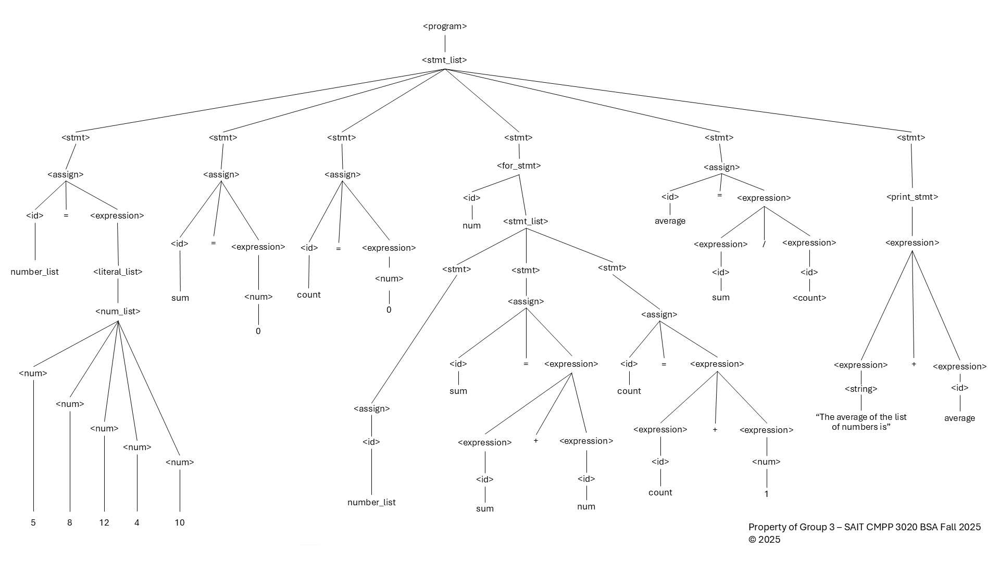
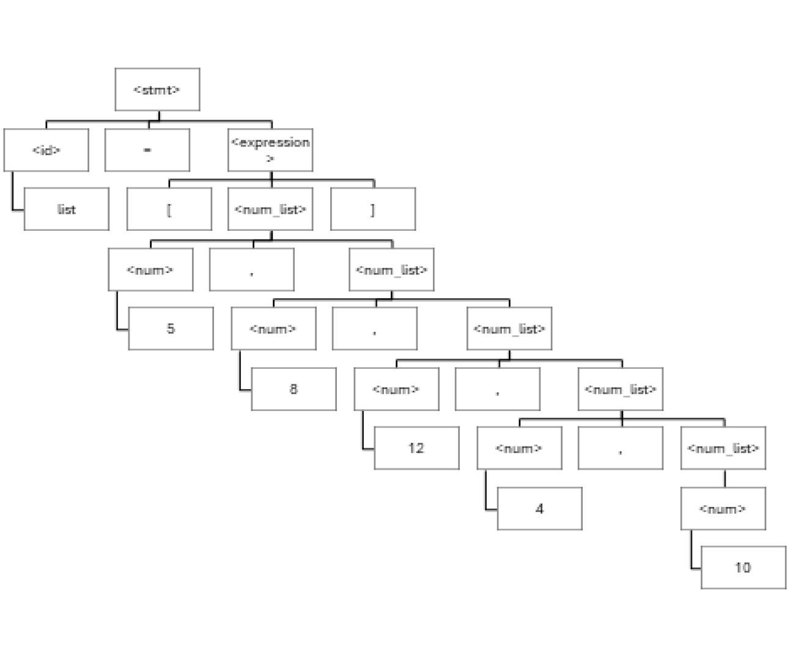
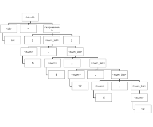

# Part B: Syntax Description
## By Group 3, CMPP 3020 BSA, Fall 2025 - BTech
### Michelle, Umaya, Altamish, Jazmin, Mihir, Nathan
#### 1. Problem Statement: Finding the Average

Given a set of numbers, how can we find their average?

Example: Given the numbers [5, 8, 12, 4, 10], calculate the average.

#### 2. Develop pseudo code to solve the problem statement outlined in Step 1.
Use descriptive variable names and comments to enhance readability and understanding.
```
BEGIN
  //Initiate the list variable with values
  SET numbers_list TO [5, 8, 12, 4, 10]

  // Initiate both the sum and count variables to zero
  SET sum TO 0
  SET count TO 0

  // Loop through each number in order to find the sum and count
  FOR EACH number IN numbers_list
    SET sum TO sum + number
    SET count TO count + 1
  END FOR

  // Create an 'average' variable and calculate
  SET average TO sum / count

  // Print the result
  PRINT "The average of the list of numbers is " + average
END

```

#### 3. Write a Backus-Naur Form (BNF) grammar to describe the syntax of the problem statement.
Construct a parse tree based on the BNF grammar to visualize the syntactic structure of the problem.

#### Grammar Rules
```
<program>	        --> <stmt_list> 

<stmt_list>		    --> <stmt> | <stmt>; <stmt>

<stmt>			    --> <assign> | <for_stmt> 'for' | <print_stmt> 'print'

<assign>		    --> <id> = <expression>

<for_stmt>		    --> for each <id> in <stmt_list>

<print_stmt>		--> print 'print' <expression>

<expression>		--> <expression> + <expression> | <expression> / <expression> | <id> | <list_literal> | <num> | <string>

<list_literal>		--> [ <num_list> ]

<num_list>		    --> <num> | <num>, <num_list>

<id>                --> number | numbers_list | sum | count | average

<num>			    --> 0 | 1 | 2 | 3 | 4 | 5 | 6 | 7 | 8 | 9

<string>		    --> "The average of the list of numbers is"

```
##### Program & Program Grammar: Translated from our Pseudo Code
--- 

###### Program: Average with comments

```
#Begin the program
#Initate variables
numbers_list = [5, 8, 12, 4, 10]
sum = 0
count = 0
  
#Declare for loop using 'num' to iterate each number in the list
for num in numbers_list:
    sum = sum + num
    count = count + 1

#Outside the scope of the loop, we are creating a variable and calculating.
average = sum / count

#Print the result
print "The average of the list of numbers is" + average

#End of our program
```

Note, comments denoted by # are just to explain the coders thinking when translating from Pseudo to Python and are not going to be parsed for the tree. It is simply to convey an understanding to a new reader to help build familiarity through our chosen Python language for this assignment.

Suppose students have been asked to submit the assignment with no # comments:
##### Python Code submitted to our program without comments
```
numbers_list = [5, 8, 12, 4, 10]
sum = 0
count = 0

for num in numbers_list:
    sum = sum + num
    count = count + 1

average = sum / count

print "The average of the list of numbers is" + average

```

Parse Tree: based on the average program submission
------


#### 4. Examine the parse tree constructed in Step 4 to determine if the BNF grammar is ambiguous.


Identify any areas where multiple interpretations are possible.

Provide examples or scenarios to illustrate potential ambiguities and their implications.

#### 5. Rewrite the BNF grammar using Extended Backus-Naur Form (EBNF) to enhance readability and expressiveness.

Explain the benefits of using EBNF over traditional BNF, particularly in terms of readability and clarity.
> The benefits of using EBNF over traditional BNF are that it improves the readability and clarity of the grammar
rules by making them more concise and compact. This is achieved by using brackets to indicate repetitions, grouping, and 
optional elements, which reduce the need for many rules, making it easier to follow along.

Remove any ambiguity present in the BNF grammar through syntax modifications in the EBNF version.

```
program>	        --> begin <stmt_list> end

<stmt_list>		    --> <stmt> {; <stmt>}

<stmt>			    --> <assign> | <for_stmt> | <print_stmt>

<assign>		    --> <id> = <expression>

<for_stmt>		    --> for each <id> in <stmt_list> endfor

<print_stmt>		--> print <string> + <id>

<expression>		--> <term> {(+ | /) <term>}

<term>              --> <id> | <list_literal> | <num>

<list_literal>		--> "[" <num_list> "]"

<num_list>		    --> <num> {, <num>}

<num>               --> <digit> {<digit>}

<digit>			    --> 0 | 1 | 2 | 3 | 4 | 5 | 6 | 7 | 8 | 9

<string>		    --> "The average of the list of numbers is"

```

#### 6. Use the EBNF grammar to reconstruct a parse tree, demonstrating how the revised syntax resolves any ambiguities present in the original BNF grammar.
Analyze and compare the parse trees from Steps 4 and 7 to understand the impact of syntax modifications on the parse tree structure.
