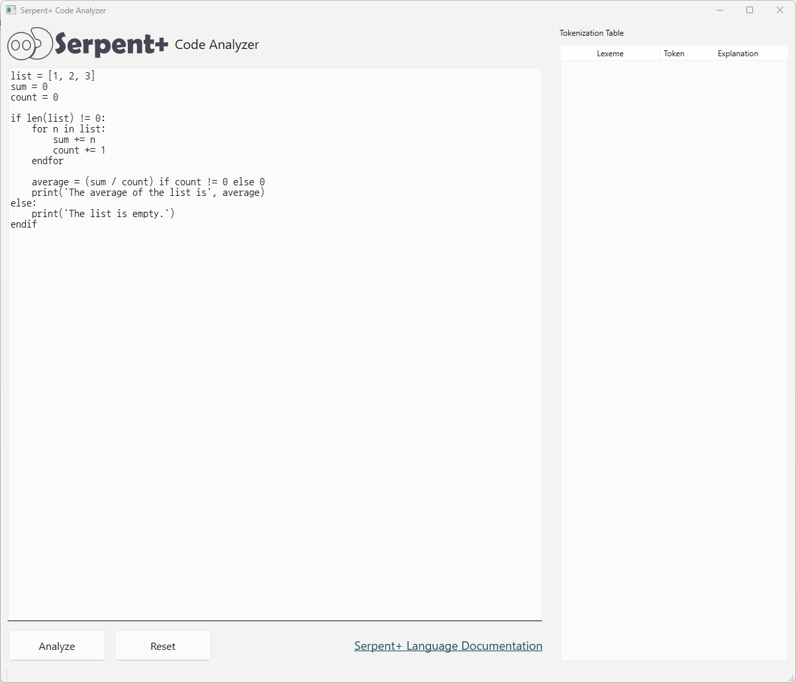

# CMPP 3020 Assignment 1 - Concepts, Syntax, and Lexical Analysis
## By Group 3, CMPP 3020 BSA, Fall 2025 - BTech
### Michelle, Umaya, Altamish, Jazmin, Mihir, Nathan

## Overview
This project is a simple lexical analyzer and parser for Serpent+, a custom, Python-inspired programming language. The repository contains our work for Parts B and C of the assignment, culminating in a graphical user interface (GUI) that allows users to write, analyze, and debug their Serpent+ code.

The application processes the input code, performs a lexical analysis to break it into tokens, and then parses it to verify its syntactic correctness according to the language's grammar.

## Part B: Syntax Description
This part contains the theoretical groundwork for the Serpent+ language. The [PartB_Syntax_Description.md](https://github.com/michellealzola/CMP3020_Assignment01_Group03/blob/master/PartB/PartB_Syntax_Description.md)
file located in the [PartB](https://github.com/michellealzola/CMP3020_Assignment01_Group03/blob/0601e776ad271492fe6830a901bbb514a0068cf0/PartB) folder contains our pseudocode, BNF and EBNF rules, and parse trees.

## Part C: Lexical Analyzer & Parser
This is the main application, a simple lexical analyzer and parser program written in Python to analyze our own Python-inspired language, Serpent+. We created a GUI that allows users to test their Serpent+ code to check for correct syntax and view error messages. All related files are located in the [PartC](https://github.com/michellealzola/CMP3020_Assignment01_Group03/blob/4f30f089707ceb49d89eeb7685bf98a4136f7101/PartC) folder.

### The Serpent+ Language
Serpent+ was designed as an educational language that blends Python's readability with the structural clarity of explicit block terminators (e.g., endfor, endif). This makes the language's grammar unambiguous and easier to analyze.

The documentation for the Serpent+ language we created can be found in the: [serpent_language_documentation.md](https://github.com/michellealzola/CMP3020_Assignment01_Group03/blob/master/PartC/serpent_language_documentation.md) file.
### Recognized Tokens and Lexemes
The valid lexemes and tokens this program analyzes can be found in the [token_lexeme.txt](https://github.com/michellealzola/CMP3020_Assignment01_Group03/blob/4f30f089707ceb49d89eeb7685bf98a4136f7101/PartC/token_lexeme.txt) 
file. 

### How to Run
To run the program, download and unzip the SerpentPlus.zip folder which can be found [here](https://1drv.ms/u/c/301e30a28b7b645d/EUgWa7LpCq1DgmZEwm5wq0QB9CI0qdGVp3DKvEJNyO2OlA?e=dLRDaw). Inside contains the SerpentPlus.exe which can be double-clicked to launch.

### Navigating The GUI
Within the application, you may insert your Serpent+ code into the given textbox and then press the "Analyze" button, which will return a table of tokens based off of your code. If the syntax passes, you will receive a "Syntax analysis completed successfully," message. 
If your code contains lexical or syntax errors, an applicable error message will arise and the line of code that spawned the error will be highlighted.

If you wish to continue testing different code, simply press the "Reset" button and add as much code as you would like!

### Serpent+ GUI Preview

## Built With
[Python 3.13.7](https://www.python.org/downloads/release/python-3137/) (Python Version)\
[PyCharm](https://www.jetbrains.com/pycharm/) (Python IDE)\
[PySide6](https://pypi.org/project/PySide6/) (GUI)
